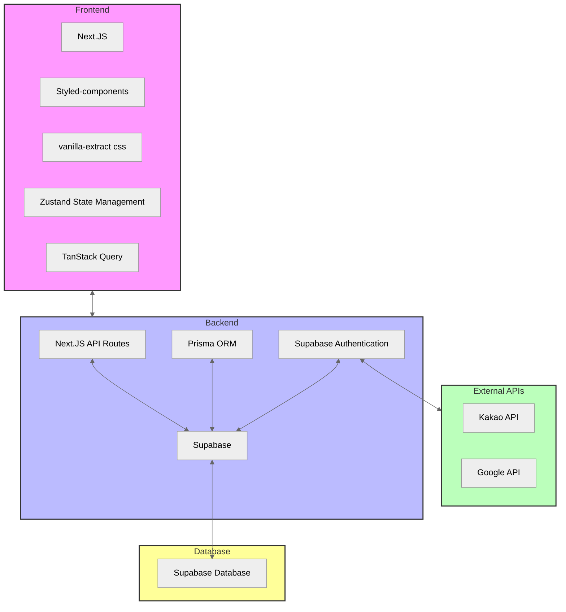

# K-캔버라 (호주 한인 커뮤니티 - 1인 개발)

프로젝트 기간: 2024.06.10 ~ 진행 중  인원: 1인 개발
 사용 기술: Next.JS, tanstack-query, zustand, Supabase, Prisma, Styled-components, vanilla-extract css, kakao API, Google API
 배포: https://www.kcanberra.com/

`K-캔버라`는 호주 캔버라에 거주하는 한인들을 위한 커뮤니티 웹사이트입니다. 이 웹사이트는 캔버라에 거주하는 한인들이 서로 소통하고 정보를 공유하며, 지역 사회에 쉽게 적응하고 통합할 수 있도록 돕는 것을 목표로 합니다. 이 프로젝트는 Next.JS, tanstack-query, Supabase, Prisma, Styled-components, vanilla-extract css, kakao API, Google API 등을 사용하여 개발됩니다.

### 기술 스택

프론트엔드: Next.JS, Styled-components, vanilla-extract css 
백엔드: Next.JS (API Routes), Supabase, Prisma  
인증: Supabase auth  
데이터 페칭 및 상태관리: tanstack-query, fetch API, zustand  
API 연동: Kakao API, Google API  

## Architecture

