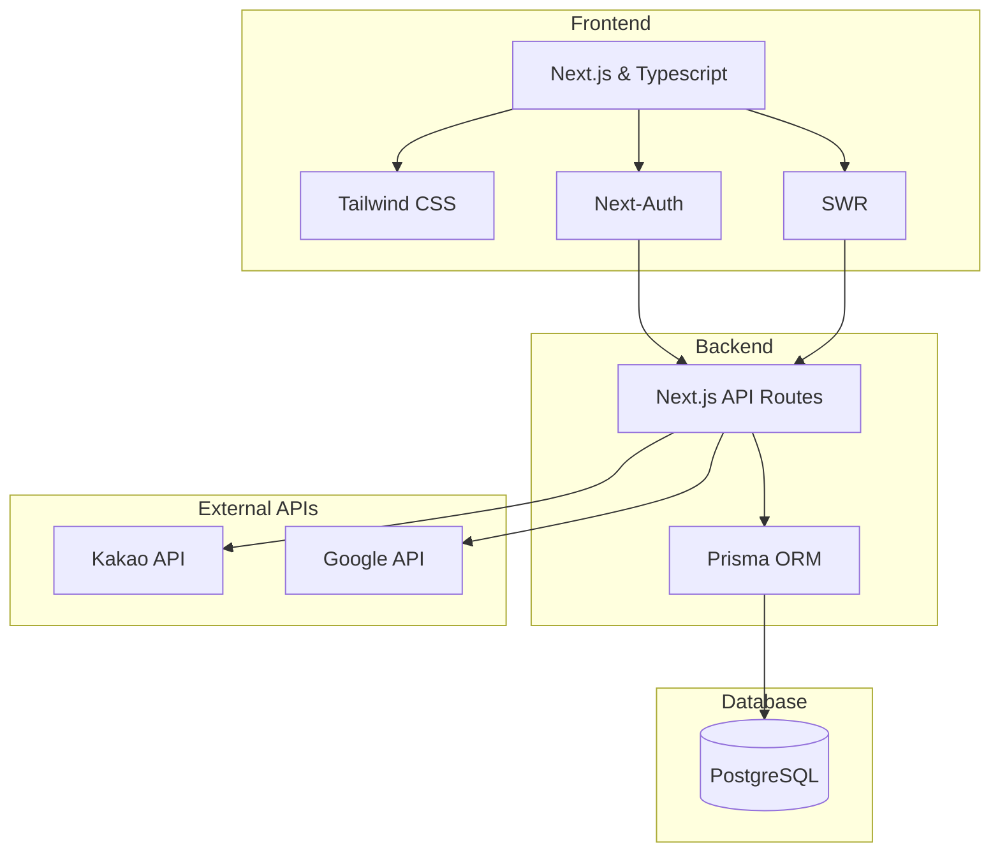

# 캔버라커넥트 (호주 한인 커뮤니티 - 외주 개발)

프로젝트 기간: 2024.06.10 ~ 2024.08.14  인원: 1인 개발
 사용 기술: Next.JS, Next-Auth, SWR, Prisma, Typescript, Tailwind, kakao API, Google API
 배포(임시): https://cbrconnects.vercel.app

`캔버라커넥트`는 호주 캔버라에 거주하는 한인들을 위한 커뮤니티 웹사이트입니다. 이 웹사이트는 캔버라에 거주하는 한인들이 서로 소통하고 정보를 공유하며, 지역 사회에 쉽게 적응하고 통합할 수 있도록 돕는 것을 목표로 합니다. 이 프로젝트는 Next.JS, Next-Auth, SWR, Prisma, Typescript, Tailwind, Kakao API, Google API 등을 사용하여 개발됩니다.

### 기술 스택
프론트엔드: Next.JS, Tailwind CSS, Typescript
백엔드: Next.JS (API Routes), Prisma
인증: Next-Auth
데이터 페칭: SWR
API 연동: Kakao API, Google API

### Next.JS 프론트엔드

페이지 렌더링: 사용자에게 보이는 웹 페이지를 렌더링합니다.
UI 컴포넌트: Tailwind CSS로 스타일링된 UI 컴포넌트를 사용합니다.
SWR로 데이터 페칭: 클라이언트 측에서 데이터를 효율적으로 가져오고 캐싱합니다.
### Next.JS 백엔드

API 라우트: 클라이언트에서 오는 요청을 처리하고 필요한 데이터를 제공합니다.
Next-Auth로 인증: 사용자 인증 및 세션 관리를 처리합니다.
Prisma로 DB 액세스: 데이터베이스와 상호작용하여 데이터를 읽고 씁니다.
데이터베이스

사용자 정보: 사용자 계정 및 프로필 정보를 저장합니다.
게시물 데이터: 사용자들이 게시하는 글과 댓글을 저장합니다.
기타 커뮤니티 데이터: 댓글, 추천 등 커뮤니티 활동과 관련된 데이터를 저장합니다.
### 외부 API

Kakao API: Kakao 인증 및 기타 Kakao 플랫폼 기능을 통합합니다.
Google API: Google 인증 및 기타 Google 서비스 기능을 통합합니다.
