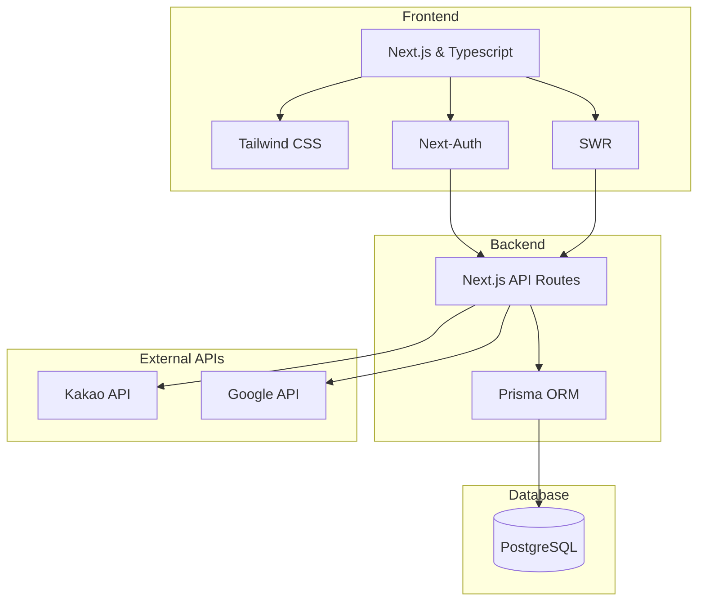

# 캔버라커넥트 (호주 한인 커뮤니티 - 외주 개발)

프로젝트 기간: 2024.06.10 ~ 2024.08.14  인원: 1인 개발
 사용 기술: Next.JS, Next-Auth, SWR, Prisma, Typescript, Tailwind, kakao API, Google API
 배포(임시): https://cbrconnects.vercel.app

`캔버라커넥트`는 호주 캔버라에 거주하는 한인들을 위한 커뮤니티 웹사이트입니다. 이 웹사이트는 캔버라에 거주하는 한인들이 서로 소통하고 정보를 공유하며, 지역 사회에 쉽게 적응하고 통합할 수 있도록 돕는 것을 목표로 합니다.

